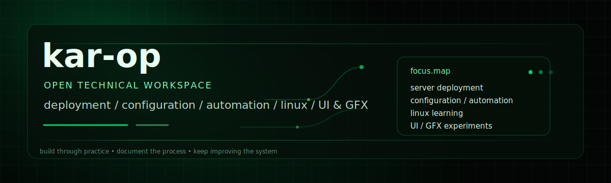

  

  
  
  
  

# kar-op

Open workspace for deployment, configuration, automation, Linux learning, and UI/GFX experiments.

## Current focus

* Server deployment and configuration
* Automation and repeatable workflows
* Learning Linux through practical projects
* Experimenting with new systems, tools, and setups
* Building cleaner visual presentation for technical projects
* Turning notes and experiments into public, readable project work

## Workspace

| Area          | Direction                                                      |
| ------------- | -------------------------------------------------------------- |
| Deployment    | Server setup, hosting, environments, and release flow          |
| Configuration | Practical setup work, tuning, and system reliability           |
| Automation    | Scripts, checks, repeatable workflows, and process improvement |
| Linux         | Hands-on learning through real tasks and experiments           |
| UI / GFX      | Visual structure, project presentation, interface ideas        |
| Experiments   | Trying new systems, tools, workflows, and technical concepts   |

## Project style

I like projects that combine practical setup work with visible output: something deployed, configured, documented, tested, or improved.

This profile is where I collect public technical work, learning projects, and experiments that connect systems, deployment, automation, and visual presentation.

## Active direction

* Building and improving **Matomumas Lab**
* Practicing GitHub workflow, CI/CD, and deployment habits
* Creating small projects that are useful for learning, testing, and demonstration
* Keeping documentation close to the actual build process

Pinned repositories below are the main workspace.
